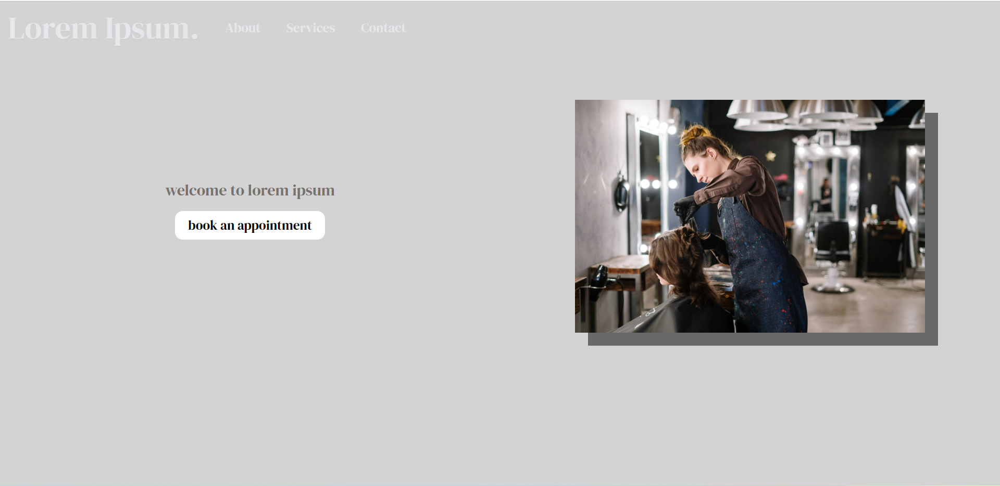
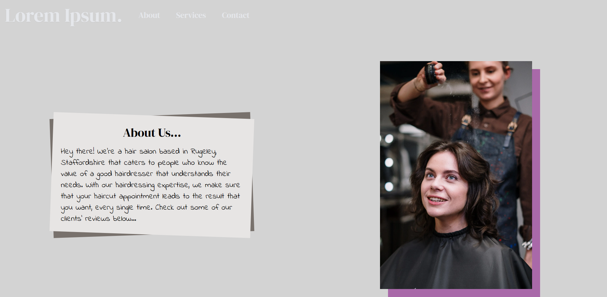
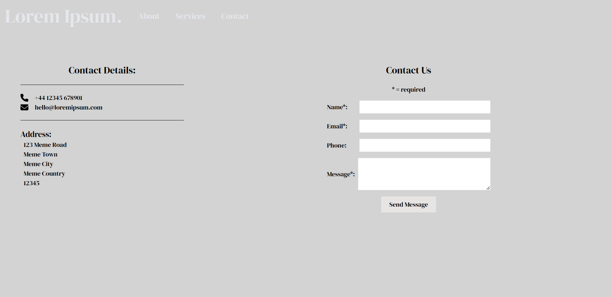
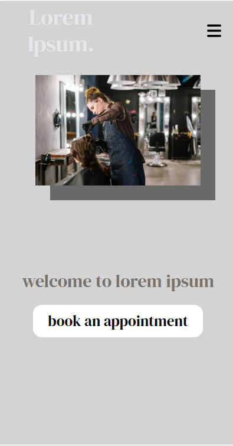

## Svelte.js Website Mock-up
### Project brief
The aim of this project was to create a static front-end for a(n unnamed) hair salon. The idea was that the website should be simple, elegant, easy to use and ideally should serve as an information page for website visitors. This project also helped me to learn the basics of Svelte.js and helped me understand its strengths vs something like React which has a much bigger ecosystem but cannot deal with SSR/SSG by itself unless you use the Next.js framework or Gatsby.js. 

### Links
[Link to live deployment](https://svelte-example-app.vercel.app/)

### Website screenshots

### Tech Stack
- Svelte.js 
- Typescript
- TailwindCSS

### Contact
[Twitter - @joshmo_dev](https://twitter.com/joshmo_dev)